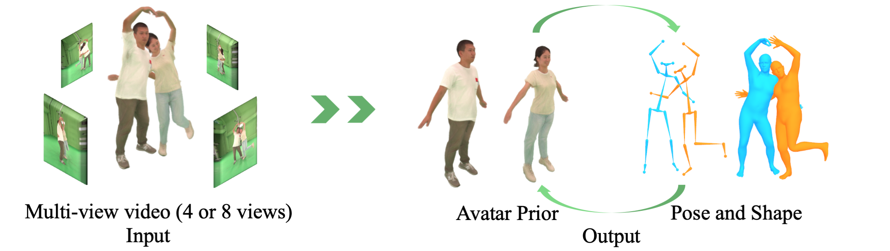

# AvatarPose: Avatar-guided 3D Pose Estimation of Close Human Interaction from Sparse Multi-view Videos

## [Paper](https://arxiv.org/abs/2408.02110) | [Supplementary](assets/supplementary.pdf) | [Video](https://www.youtube.com/watch?v=y_T67l9j_TA) | [Project Page](https://eth-ait.github.io/AvatarPose/)

 

Official code has be released soon for ECCV 2024 paper [*AvatarPose: Avatar-guided 3D Pose Estimation of Close Human Interaction from Sparse Multi-view Videos*](feichilu.github.io/AvatarPose/). AvatarPose leverages the personalized implicit neural avatar of each individual as a prior, and significantly improves the robustness and precision of multi-person pose estimation task of close interactions from multi-view videos.

# News
- [2024/07/01] AvatarPose is accepted to ECCV 2024!
- [2024/08/18] AvatarPose code is released!

# Overview

This project can be used to optimize the 3D SMPL pose registration from multi-view videos. The project is divided into the following steps:
1. Preprocessing the captured data and initializing the SMPL model.
2. Creating an avatar from the captured data with the initialized SMPL.
3. Optimizing the SMPL model using the avatar and the RGB information.

Note that for very bad SMPL initialization, the optimization may not converge to the correct pose. In such cases, the user may need to manually adjust the initialization or use a different optimization method.

# Setup Instructions

## Body Models
Download the SMPL models as required by the `smplx` package and put them into `$SMPLX_MODELS`. The directory should look like this:

```
├── data/SMPLX
│   ├── smpl
│       ├── SMPL_FEMALE.pkl
│       ├── SMPL_MALE.pkl
│       └── SMPL_NEUTRAL.pkl
|   └── smplx
│   └── J_regressor_body25.npy
```

## Dependencies
Install PyTorch with GPU support and a compatible CUDA version. This repository was tested with Python 3.8.0, PyTorch 1.13.1 and CUDA 11.6.

Run the bash file to install the required packages:
```
bash run_install.sh
```

This repository was also tested on cuda 11.8.0, pytorch 2.0.0, python 3.9.18.

Run the bash file to instlal packages:
```
bash run_install_2.sh
```


# How to use
## Preprocessing
Download [Hi4D dataset](https://yifeiyin04.github.io/Hi4D/).
To preprocess the Hi4D data, change the `CAPTURE_ROOT` and `DATA_ROOT` in `bash/run_multi/preprocess.sh` and run
```
export PYTHONPATH=$(pwd)
bash bash/run_multi/preprocess.sh
```
Results are in `Hi4D_AvatarPose` dataset.

## 3D keypoint initialization
First we build 4DAssociation in the `third_parties` folder. 
```
cd third_parties/4d_association/build/linux-native
./make-Makefiles.sh
make
```
Some prerequisites of the 4DAssociation repository can refer to the instructions of [4DAssociation](third_parties/4d_association/README.md). Then change `DATA_ROOT` and `OPENPOSE_ROOT` in `bash/run_multi/run_4DA.sh` and run 4D Association to get the 3D keypoints estimation using:
```
bash bash/run_multi/run_4DA.sh
```
The output is in the `skel19_4DA` directory under `$DATA_ROOT`.

## SMPL initialization
Run the method `mvpose` to get estimated smpl parameters. First follow the install instrction in the third party repository [Easymocap](third_parties/Easymocap/Readme.md).
```
cd third_parties/Easymocap
python setup.py develop
cd -
```
Change `DATA_ROOT` in `bash/run_multi/run_mvpose.sh`, then run the smpl registration pipeline:
```
bash bash/run_multi/run_mvpose.sh
```
Output is the `smpl_init` folder under `$DATA_ROOT`.

To get the skel19 keypoints from `smpl_init`, change `DATA_ROOT` and run
```
bash bash/run_multi/save_mvpose_kpts.sh
```
Output is the `skel19_fit` folder under `$DATA_ROOT`

## SAM-Track tracking mask
Follow the instructions  in the third party [SAM-Track](third_parties/sam_track/README.md) repository, change `DATA_ROOT` and then run:
```
bash bash/run_multi/run_sam_track.sh
```
Output is the `mask_sta` folder under `$DATA_ROOT`.

## Train avatars and poses
```
bash bash/run_multi/train_hi4d.sh
```

## Visualize Avatars and Poses
```
bash bash/run_multi/visualize_hi4d.sh
```
Visualization of 3D keypoints reprojection:
```
python scripts/draw_kpts.py
```

## Evaluate Avatars and Poses
```
python scripts/print_loss.py
```

